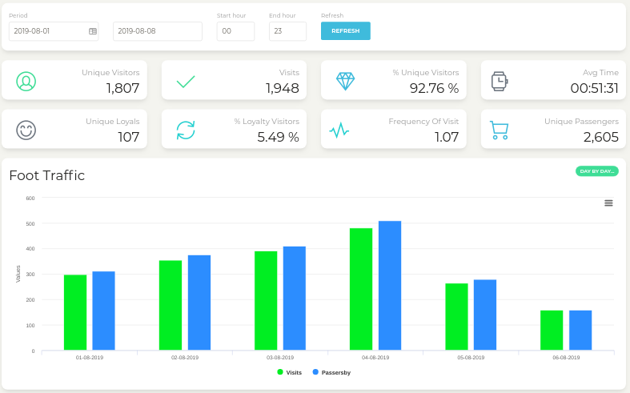
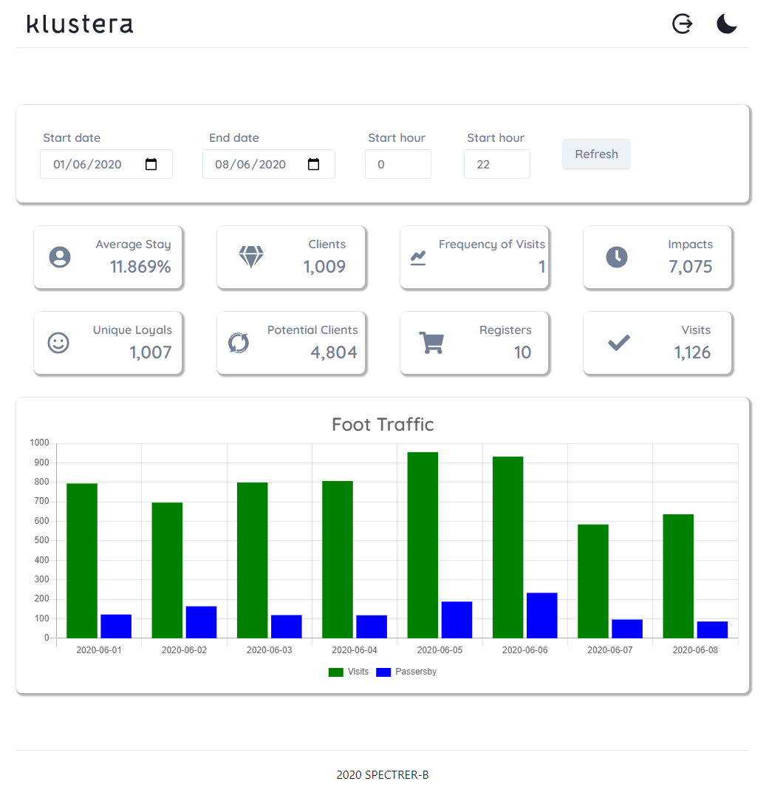
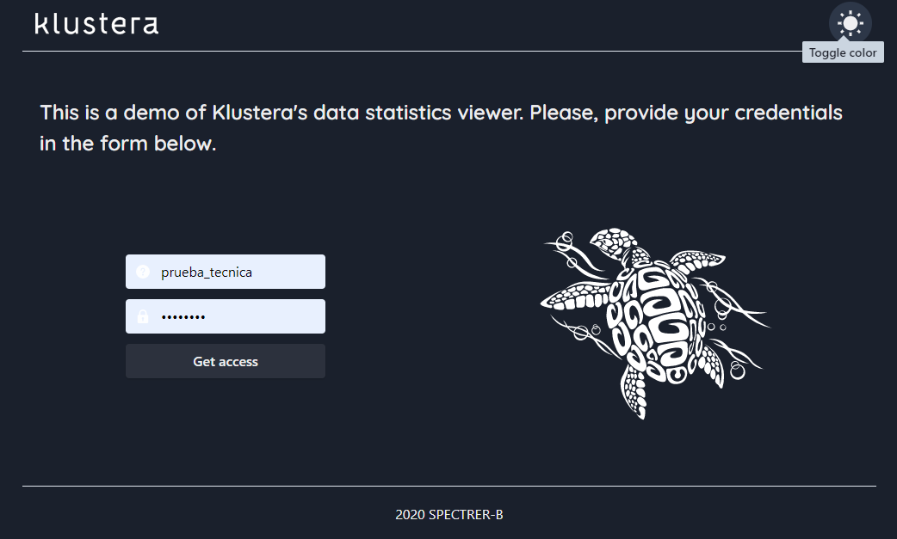
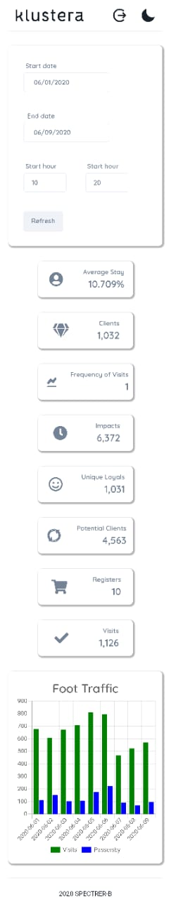

# Technical Test App for Klustera
This project is a challenge dashboard by Klustera.com [Klustera.com](https://www.Klustera.com)

## Interactions

To run this project, please:

- Fork this repo
- Clone this repo
- In the terminal, run:

  ```
  yarn install
  yarn start
  ```

## Objective

Create an app using a framework such as Angular, Vue or React, that consumes and displays statistical data from a proprietary API. In order to get data from the API, the app must contain a login form to fetch an access token that expires in two hours. The app should look like this:

<div style="display: flex; justify-content: center">
  
</div>

## Result

I created the app using React for the logic and [Chakra UI](https://chakra-ui.com/) for the styling. I implemented the agile methodology known as kanban, hitting a Development time of 20 hours, you can view my board [here](https://trello.com/b/CqkN27Cy/klustera-test-app). The result looks like this:

<div style="display: flex; justify-content: center">
  
</div>

## Deployed Site

I used vercel to deploy the app to the world. You can visit it [here](https://klustera-test-app.vercel.app/).

## Extra features

I added the following extra features to show my skills:

- Responsive desing (see images below)
- A minimalist landing page
- Replica of klustera's logos and favicon
- UX features such as loading hints and hoover tooltips
- Error handling and feedback for the user
- Reactive logout button
- Dark mode support (see images below)

## Dark mode

You can turn it on using the moon in top-right corner of the app.

<div style="display: flex; justify-content: center">
  
</div>

## Responsive desing

I implemented fully responsive design using the mobile-first methodology.

<div style="display: flex; justify-content: center">
  
</div>

## Contact me!

I'm open for bussiness, reach me on:

- Site: [adrio.now.sh](https://adrio.now.sh/)
- Email: [d-rio@outlook.com](https://d-rio@outlook.com/)
- Phone: +52 55 3735 5309
- [LinkedIn](https://www.linkedin.com/in/adrio1992/)

# Developed in Mexico by Armando del Río (SPECTER-B)
